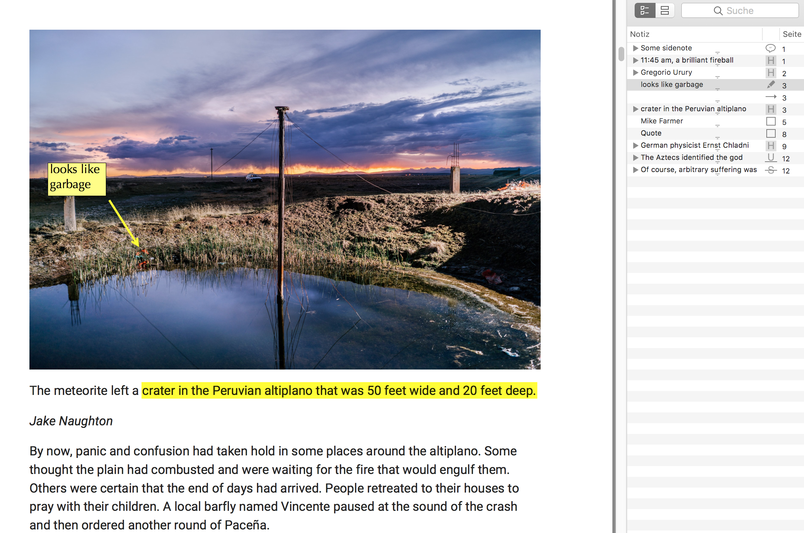
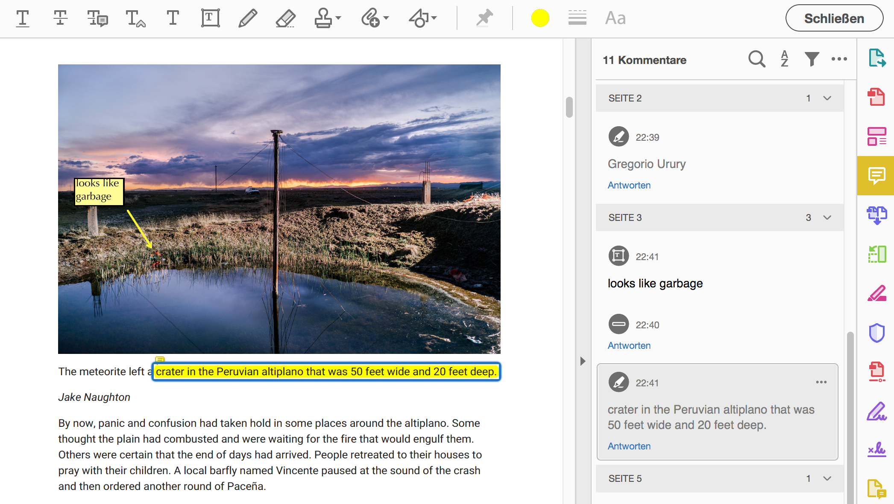

# SkimPDF

[Skim](https://skim-app.sourceforge.io/) is a PDF viewer with great search and annotation tools for OSX. It stores annotations in a non-standard format, thus the annotation can not viewed or edited in other PDF viewer like Adobe Acrobat Reader. However, Skim can convert Skim notes to standard PDF notes (embed) or make PDF notes editable in Skim (unembed).


PDF viewed in Skim with Skim annotations.


The same PDF with embedded annotations viewed in Adobe Acrobat Reader DC.

## How it works

The Python class `SkimPDF` builds on `skimpdf` to automate the conversion step:

1. Embed notes
2. Unembed notes
3. Batch embed and unembed notes (works with nested folders)

I have used the script to embed Skim notes of 568 pdfs scattered in a folder with various subfolders. It took about 5 minutes. Be aware, that the script won't process files with a `"` in its filepath and that the files are overwritten, so make a copy before running on large sets of files.

## How to use it

There are two options how to use the Python script:

1. Use the Python class by loading the class as a module in a Python script.
2. Use the OSX Automator or Alfred Workflows as a wrapper for the Python class.

### OSX-Automator

For ease of use, I have wrapped the python script in the OSX Automator workflows `Convert to pdf notes.workflow` and `Convert to skim notes.workflow` to process one or more selected PDFs. The script detects if one PDF or multiple PDFs or folders have been selected and automatically batch processes it.

1. Download the Automator Workflows [here]("./releases/latest")

Install the Automator Workflows by double-clicking on the donwloaded file and select "Install as service."

The workflows process a selected PDF file, or multiple PDFs, folders, and nested folders (batch processing). Non-PDF files are ignored.

**WARNING:** The workflows overwrite the selected files.

### Alfred Workflows

For ease of use, I have wrapped the python script in the [Alfred Workflows](https://www.alfredapp.com/) `PDF to Skim notes.alfredworkflow` and `Skim to PDF notes.alfredworkflow` to process one or more selected PDFs.

The workflows process a selected PDF file, or multiple PDFs, folders, and nested folders (batch processing). Non-PDF files are ignored.

**WARNING:** The workflows overwrite the selected files.

### Run as Python script (CLI)

If you need to have more control on the script like making a copy of the converted pdf instead of overwriting it, then you can access the Python class options by loading class as a module in a python script or via CLI.

#### Available options

```
skim = SkimPDF()

# Path to skimpdf
skim.skimpdf_path = '/Applications/Skim.app/Contents/SharedSupport/skimpdf'

# Replace pdf or place a copy in place
skim.replace_original = True

# If skim.replace_original is set to False,
# then you can set the embed or unembed suffix
skim.embed_suffix = '_embedded'
skim.unembed_suffix = '_skim_notes'
```

#### Available methods

```
# Convert Skim notes to PDF notes (embed)
skim.convert_to_pdf_notes('../path/to/pdf file.pdf')

# Convert PDF notes to Skim notes (unembed)
skim.convert_to_skim_notes('../path/to/pdf file.pdf')

# Batch convert notes in a folder
skim.batch_convert_to_pdf_notes('../path/to/Literature folder')
skim.batch_convert_to_skim_notes('../path/to/Literature folder')
```
